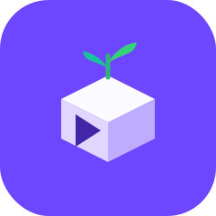
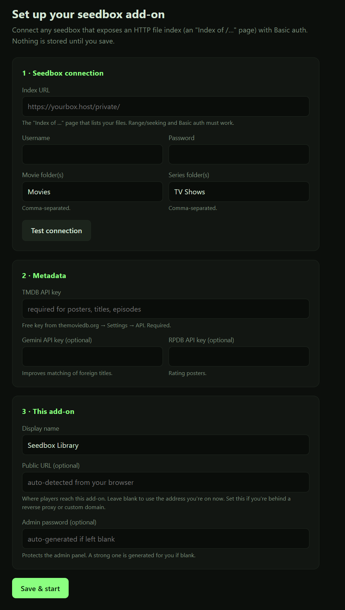

<p align="center">
  
</p>

<h1 align="center">nuvio-seedbox-addon</h1>

A small self-hosted add-on that puts your seedbox library inside [Stremio](https://www.stremio.com/) or [Nuvio](https://github.com/NuvioMedia), next to whatever else you already stream there.

It reads the files your seedbox already serves over HTTP (the plain "Index of /…" listing behind your username and password), matches them against TMDB for posters and details, and lists them as normal catalogs. Press play and the video comes straight off your seedbox to your player. The add-on only handles the listing and the subtitles, so it never sits in the middle of your stream.

You set the whole thing up in a browser. There's no config file to edit and nothing to compile.

## Who this is for

If you pull releases from private trackers onto a seedbox, and you've also been watching Debrid content through Stremio or Nuvio, this lets you keep both in the same app. Your Debrid add-ons don't change at all. This just adds your own seedbox library alongside them, so you can browse and play your files without opening a separate web UI or an FTP client.

It assumes you're comfortable running a small program *somewhere* that stays on. That can be the seedbox itself, a spare machine at home, a cheap cloud box, or Docker. It does not assume you can write code; the setup is a form in your browser.

> I built this for my own setup and use it every day: a [Whatbox](https://whatbox.ca) seedbox, reached both from a Windows laptop and from the Whatbox server itself. If your setup looks like that, there's a good chance I can help when something goes sideways. None of it is tied to Whatbox or Windows, though. The same code runs on macOS (MacBook, Mac mini), Linux, Docker, and cloud hosts like Render, and any seedbox that exposes an HTTP file index with a login should work.

> Your seedbox address, login, and API keys stay in your own copy (`data/settings.json`) and are never sent anywhere.

## What it does

- Lists your movies and series as catalogs. Series are grouped by language: English, Korean, Chinese, Japanese, Thai, and an Others row for everything else.
- Streams straight from the seedbox to the player. It hands over a direct link with your login attached, so it stays out of the video path and playback is as fast as your box.
- Finds sidecar subtitles (`.srt`, `.ass`, `.ssa`) sitting next to each video and serves them, converting ASS/SSA to SRT on the way out.
- Fills in posters, cast, ratings, runtime, trailers, and per-episode thumbnails and summaries from TMDB.
- Re-scans on a schedule and only looks at what changed, so new downloads turn up on their own. While a scan runs, a progress bar in the admin panel shows which phase it's in and which title it's on.
- Has an admin page for checking library health, pinning the occasional title TMDB gets wrong, and changing settings without a restart.
- Stays private. The install link carries an unguessable secret, and the admin page has its own separate password.

## What it looks like

Once it's running, your library shows up in Nuvio/Stremio as rows by language, with posters and ratings:


## Getting started

Two things to do: get a free TMDB key, then run the add-on somewhere. Pick the "somewhere" that matches what you have. Each option below is a full walkthrough.

### Step 1 — Get a free TMDB API key

TMDB provides the posters, titles, and episode data. It's free.

1. Go to https://www.themoviedb.org/signup and make an account (confirm the email they send).
2. Open https://www.themoviedb.org/settings/api.
3. Click **Create**, choose **Developer**, and accept the terms.
4. Fill in the short form. For "Application Name" put anything (e.g. `My Seedbox`), for URL put `http://localhost`, and fill the rest with anything reasonable.
5. Copy the long string labelled **"API Key (v3 auth)"**. You'll paste it during setup.

### Step 2 — Decide where to run it

The add-on needs to stay on. Where you put it decides whether you can reach it only at home or from anywhere, including your phone on mobile data.

| Where you run it | Good if you have | Reachable away from home? |
|---|---|---|
| On your seedbox (Option C) | a seedbox you can SSH into | Yes, automatically |
| Free cloud, Render (Option D) | no spare computer | Yes, automatically |
| An always-on home device (Option B) | something you leave on 24/7 | Yes, with one extra step |
| Your everyday laptop (Option A) | just a laptop, trying it out | Only while it's on, otherwise needs a step |

If your seedbox lets you SSH in, Option C is the easiest because it's already online around the clock. No spare computer at all? Use Render (Option D).

<details>
<summary><b>Option A — Your laptop or desktop (Windows or Mac), easiest way to try it</b></summary>

<br>

**Windows:**

1. Install Node.js. Go to https://nodejs.org, click the big **LTS** download, run the installer, and click through with the defaults.
2. Download the add-on. On this GitHub page, use the green **`< > Code`** button, then **Download ZIP**. Right-click the file and choose **Extract All**. You get a folder called `nuvio-seedbox-addon`.
3. Open a terminal in that folder. Open the extracted folder, click in the address bar at the top, type `powershell`, and press Enter.
4. Start it. Type these two lines, pressing Enter after each (the first takes a minute):
   ```
   npm install
   npm start
   ```
   When you see `…add-on running on port 7700`, it's up. Leave the window open; closing it stops the add-on.
5. Open http://localhost:7700/setup and follow [Step 3](#step-3--finish-setup-in-your-browser).

**Mac (MacBook, iMac, Mac mini):**

1. Install Node.js. Go to https://nodejs.org, download the **LTS** `.pkg`, and run it.
2. Download the add-on with the green **`< > Code`** button, then **Download ZIP**, and double-click the ZIP to unzip it.
3. Open the **Terminal** app, type `cd ` (with a space), drag the unzipped folder onto the window, and press Enter.
4. Start it (first command takes a minute):
   ```
   npm install
   npm start
   ```
   Leave the Terminal window open once you see `…add-on running on port 7700`.
5. Open http://localhost:7700/setup and follow [Step 3](#step-3--finish-setup-in-your-browser).

This is fine for a player on the same computer or the same Wi-Fi. For your phone when you're out, see [Reaching it from anywhere](#reaching-it-from-anywhere).

</details>

<details>
<summary><b>Option B — An always-on home device (Mac mini, mini PC, Raspberry Pi, home server)</b></summary>

<br>

Same as Option A, plus a step to keep it running so you don't have to leave a terminal open.

1. Install Node.js on the device (see Option A, or on Linux: `sudo apt install nodejs npm`).
2. Get the code:
   ```
   git clone https://github.com/wifi-x-smasher/nuvio-seedbox-addon.git
   cd nuvio-seedbox-addon
   npm install
   ```
   No `git`? Use the Download ZIP method from Option A.
3. Keep it running with pm2, which restarts the app and survives reboots:
   ```
   npm install -g pm2
   pm2 start src/index.js --name seedbox-addon
   pm2 save
   pm2 startup
   ```
   Run the one command `pm2 startup` prints, so it auto-starts on boot.
4. Open http://localhost:7700/setup on the device itself, or `http://DEVICE-IP:7700/setup` from another machine on the network (the IP is in the device's network settings). Follow [Step 3](#step-3--finish-setup-in-your-browser). When setup asks for the Public URL, enter `http://DEVICE-IP:7700` so other devices can reach it.

To use it on your phone when you're out, see [Reaching it from anywhere](#reaching-it-from-anywhere). Tailscale is the simplest route.

</details>

<details>
<summary><b>Option C — On your seedbox (it's already online 24/7)</b></summary>

<br>

If your seedbox lets you log in over SSH and run Node.js, this is the best home for the add-on. It's always on and reachable without any extra work. This is how I run it on Whatbox.

1. SSH into your seedbox. Your provider's panel shows the host and username, e.g. `ssh you@yourbox.host`.
2. Check Node.js:
   ```
   node -v
   ```
   If you see version 18 or higher, you're set. If not, install it just for your account with nvm:
   ```
   curl -o- https://raw.githubusercontent.com/nvm-sh/nvm/v0.40.1/install.sh | bash
   source ~/.bashrc
   nvm install 20
   ```
3. Get the code:
   ```
   git clone https://github.com/wifi-x-smasher/nuvio-seedbox-addon.git
   cd nuvio-seedbox-addon
   npm install
   ```
4. Pick a port your seedbox allows. Most seedboxes hand you specific open ports, so check your provider's docs or panel (Whatbox assigns them, for example). Use that number in place of `PORT` below.
5. Keep it running so it survives logging out:
   ```
   npm install -g pm2
   ADDON_PORT=PORT pm2 start src/index.js --name seedbox-addon
   pm2 save
   ```
   If your seedbox blocks pm2, use `screen` or `tmux`, or ask your provider how they keep long-running scripts alive. Some use a cron keep-alive.
6. Open `http://YOUR-SEEDBOX-HOST:PORT/setup` and follow [Step 3](#step-3--finish-setup-in-your-browser). Use that same address as the Public URL.

If your seedbox gives you HTTPS on a subdomain, use the `https://…` address. Plain `http://host:port` works too.

</details>

<details>
<summary><b>Option D — Free cloud hosting with Render (no computer of your own)</b></summary>

<br>

Runs in the cloud, online all the time, reachable from anywhere, with no hardware.

1. Fork this repo (the **Fork** button, top-right) so it's under your account.
2. Make a free account at https://render.com and connect your GitHub.
3. In Render, choose **New → Blueprint**, pick your fork, and confirm. Render reads the included `render.yaml` and sets up the service and storage.
4. Wait a few minutes for it to deploy. Render gives you an address like `https://your-app.onrender.com`.
5. Open `https://your-app.onrender.com/setup` and follow [Step 3](#step-3--finish-setup-in-your-browser). Leave the Public URL blank; it's detected for you.

Render's free tier sleeps when idle and takes a few seconds to wake. If you want playback to start instantly every time, a small paid instance avoids that.

</details>

<details>
<summary><b>Option E — Docker (any machine, if you already use Docker)</b></summary>

<br>

```bash
git clone https://github.com/wifi-x-smasher/nuvio-seedbox-addon.git
cd nuvio-seedbox-addon
docker compose up -d
```

Open http://localhost:7700/setup (or `http://HOST-IP:7700/setup`) and follow [Step 3](#step-3--finish-setup-in-your-browser). Settings persist in `./data`. To pull a prebuilt image instead of building locally, uncomment the `image:` line in `docker-compose.yml`.

</details>

### Step 3 — Finish setup in your browser

Opening `…/setup` gives you a short form:



1. **Seedbox connection.** Paste your seedbox index URL (e.g. `https://yourbox.host/private/`) and your username and password, then click **Test connection**. It checks that the add-on can reach the box and find your `Movies` and `TV Shows` folders. If your folders have other names, type them in (comma-separated for several).
2. **Metadata.** Paste the TMDB key from Step 1. Gemini and RPDB keys are optional; leave them blank if you don't have them.
3. **This add-on.** Give it a display name (e.g. "My Library"). Leave the Public URL as suggested unless your option above told you to set it.
4. Click **Save & start**. The add-on generates a secret install link and an admin password (the password is shown once, so copy it), and starts its first library scan. The first scan can take a few minutes.

### Step 4 — Add it to Nuvio or Stremio

Copy the install link from the setup page, then:

- In Nuvio: Add-ons, **Install via URL**, paste, Install.
- In Stremio: Add-ons, paste the URL in the search box, Install.

Your rows (Movies, English, Korean, and so on) show up once the first scan finishes.

## Reaching it from anywhere

Skip this if you run on your seedbox (Option C) or Render (Option D). Those are already reachable from anywhere.

If you run on a home device or a laptop, its address (`localhost` or `192.168.x.x`) only works on your home network. To watch on your phone over mobile data, pick one of these:

- **Tailscale** is the simplest. Install the free app on both the host device and your phone and sign in with the same account on each. Then use the host's Tailscale address (e.g. `http://100.x.x.x:7700`) as the Public URL during setup. No router changes.
- **Cloudflare Tunnel** gives you a public `https://…` address pointing at your home device, also free.
- **Router port-forwarding** works but is the advanced option. Only do it if you understand the trade-offs, and keep the secret link private.

## The admin panel

Open the admin link from the setup page (your install link with `/admin` on the end). When the browser asks for a login, the username is `admin` and the password is the one you set during setup (or the one it generated and showed you on the done screen). From there you can:

- see library counts, how much matched, the last scan time, and the breakdown by language;
- watch a live progress bar and recent log while a scan runs;
- check subtitle coverage and spot orphaned subtitle files;
- find titles that didn't match and pin the right TMDB id;
- run a quick rescan (new items only) or a full re-match;
- change settings (keys, folders, poster style, scan interval) and have them apply without a restart.

## Advanced configuration (optional)

You don't need any of this. The setup page and admin panel cover everything. But if you'd rather use environment variables, for Docker or an immutable deploy, copy [`.env.example`](.env.example) to `.env`. Both `SEEDBOX_*` and the older `WHATBOX_*` names work.

| Setting | Env var | Notes |
|---|---|---|
| Index URL | `SEEDBOX_HTTP_BASE_URL` | e.g. `https://yourbox.host/private/` |
| Username / password | `SEEDBOX_HTTP_USER` / `SEEDBOX_HTTP_PASS` | HTTP Basic auth |
| Movie / series folders | `MOVIE_DIRS` / `SERIES_DIRS` | comma-separated, default `Movies` / `TV Shows` |
| TMDB key | `TMDB_API_KEY` | required |
| Gemini key / model | `GEMINI_API_KEY` / `GEMINI_MODEL` | optional, default `gemini-flash-latest` |
| RPDB key | `RPDB_API_KEY` | optional |
| Poster source | `POSTER_SOURCE` | `better` (default), `rpdb`, or `tmdb` |
| Display name | `ADDON_NAME` | shown in the player and as the stream source |
| Public URL | `ADDON_BASE_URL` | set behind a reverse proxy or custom domain |
| Access secret | `ADDON_SECRET` | generated by `/setup` if unset |
| Admin password | `ADMIN_PASSWORD` | generated by `/setup` if unset |
| Data dir | `DATA_DIR` | persistent path for index, caches, settings |
| Scan interval | `SCAN_INTERVAL_MINUTES` | default `720` (12h) |
| TLS cert / key | `TLS_CERT` / `TLS_KEY` | serve HTTPS directly, or terminate TLS at a proxy |

## How it works

```
 Nuvio / Stremio  ──asks for library/details──▶  add-on  ──reads index + TMDB──▶  metadata
        │                                           │
        └──────── plays stream URL (+ your login) ──┴──────────▶  your seedbox (direct)
```

The add-on never carries your video. It hands the player a direct seedbox link with your login header attached, so playback runs at whatever speed your box can manage. Only subtitles pass through the add-on, because the subtitle format can't carry a login, and those files are tiny.

## A note on privacy

- The secret in the install link is what keeps your library unguessable, so don't post the full link in public.
- The admin password is separate from that secret, so handing someone the install link never gives them the admin panel.
- Your keys and seedbox login live only in `data/settings.json` or your own environment, never in this repo.
- The repo ships no keys or credentials. `.env.example` is blank, and everything written at runtime (settings, overrides, the index) lives under `data/`, which is gitignored.

## FAQ

**Does the add-on slow down my streams?** No. Video goes straight from your seedbox to the player. The add-on only handles small metadata and subtitle files.

**Does it re-scan everything every time?** No. After the first scan it only looks at new or removed items, so later scans are quick.

**How soon do new downloads show up?** At the next scheduled scan (every 12h by default, and you can change it), or right away if you hit Rescan in the admin panel.

**My folders aren't called `Movies` and `TV Shows`.** Put your folder names in on the setup page, comma-separated if you have more than one of each.

**A title matched the wrong thing.** Pin the correct TMDB id from the admin panel.

**Do I have to keep my computer on?** Only if you run it on your own computer (Options A or B). On your seedbox or on Render it stays up by itself.

**I got `EADDRINUSE: address already in use :::7700`.** Something is already using port 7700, usually another copy of the add-on left running. Either run it on a different port or free up 7700.
- Run on another port (then use that number at `…/setup` and as the Public URL):
  - Windows PowerShell: `$env:ADDON_PORT=7801; npm start`
  - Mac/Linux: `ADDON_PORT=7801 npm start`
  - Docker: change the ports line in `docker-compose.yml` to `"7801:7700"`.
- Or free 7700 by stopping whatever holds it:
  - Windows PowerShell: `Get-NetTCPConnection -LocalPort 7700 -State Listen | ForEach-Object { Stop-Process -Id $_.OwningProcess -Force }`
  - Mac/Linux: `lsof -ti tcp:7700 | xargs kill`

## License

[MIT](LICENSE). Not affiliated with Stremio or NuvioMedia.
